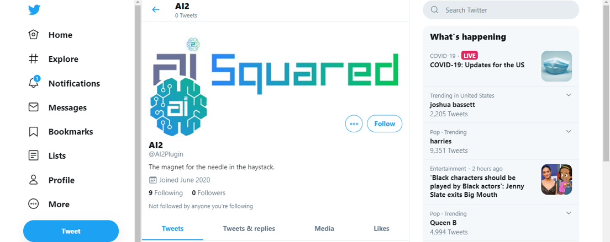
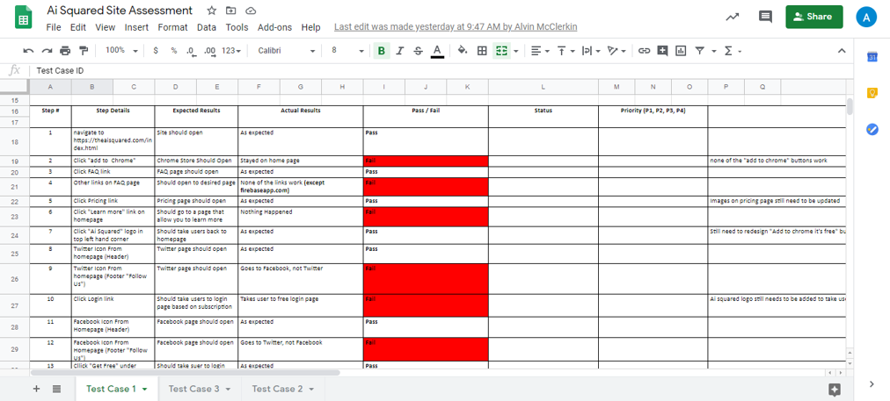

  

      <ul class="nav">
          <li><a href="https://github.com/amayagoodloe/amayagoodloe.github.io/blob/master/assets/Amaya%20Resume.pdf">cv</a></li>
          <li><a href="https://github.com/amayagoodloe/amayagoodloe.github.io">github</a></li>
          <li><a href="https://medium.com/@amaya.goodloe/unexpected-opportunities-4b6ed3babdfa?source=friends_link&sk=d70899a16517d7ba13c9a17658d17f4d">blog</a></li>
          <li><a href="http://www.linkedin.com/in/amaya-goodloe">LinkedIn</a></li>
      </ul>
  

### Portfolio

<table class="wide">
<tr>
  <td class="left">
    
  </td>
  <td class="right">
    
  </td>
</tr>
<tr>
  <td class="left">
    
  </td>
  <td class="right">
    
  </td>
</tr>
</table>

  

      <ul class="nav">
          <li><a href="morefigs.html">see more figures</a></li>
      </ul>
  

